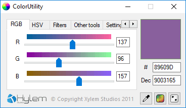

# ColorUtility

>  **Please note**: This codebase is old as *fuck*. I mean it. I might get around to cleaning it, but for now, enjoy the unedited code in all it's glory.

Simple but powerful color picker written in Visual Basic .NET. It should run on Windows XP and above.

ColorUtility was made to suit my personal needs, but I believe it will help you out!

Most color pickers out there are **bloated** with useless features. This one tries to stay as light as possible while also containing an array of useful tools. Enjoy!

## Features

- RGB, HSV, alpha support
- Clean and very easy-to-use interface
- Pick colors directly on screen
- Mutli-language (English, French, Spanish, Norwegian)
- Color filters
- Tons more, try it out and see for yourself!

## Contributing

Code contributions are welcome! Don't hesitate to make a pull request. Please note however that the project is currently not maintained.

You can follow everything from the dedicated [status repository](https://github.com/xylemstudios/status).

## License

This project and it's associated source code is licensed under the GNU General Public License 3.0.

The license does not extend to images contained in this repository (they are probably public domain).